<](http://jacamo.sourceforge.net/)
[](https://openjfx.io/)
[](https://www.oracle.com/java/)
[](LICENSE)

**A sophisticated multi-agent simulation of a bee colony ecosystem using JaCaMo framework and JavaFX visualization.**

[Features](#-features) • [Architecture](#-architecture) • [Installation](#-installation) • [Usage](#-usage) • [Team](#-team)

</div>

---

## 📋 Overview

**Melissa** is an advanced multi-agent system that simulates the complex social behaviors and organizational structure of a bee hive. Built using the **JaCaMo** framework, this project demonstrates how autonomous agents can work together through beliefs, goals, and actions to maintain a thriving colony.

The simulation models realistic bee behaviors including:
- 🍯 **Honey production and resource management**
- 🌡️ **Temperature control within the hive**
- 🥚 **Colony reproduction and larva development**
- 🔍 **Exploration and food source discovery**
- 🛡️ **Hive defense mechanisms**

---

## ✨ Features

| Feature | Description |
|---------|-------------|
| **Autonomous Agents** | Each bee operates independently with its own beliefs, goals, and decision-making |
| **Role-Based Organization** | Agents adopt roles (Queen, Nurse, Sentinel, Explorer) based on age and colony needs |
| **Real-Time Visualization** | JavaFX-powered graphics display hive state, bee movements, and statistics |
| **BDI Architecture** | Belief-Desire-Intention model for realistic agent behavior |
| **Dynamic Environment** | Simulated world with flowers, weather conditions, and seasonal changes |

---

## 🏗️ Architecture

```
melissa/
├── src/
│   ├── agt/                    # Agent definitions (Jason/AgentSpeak)
│   │   ├── queen.asl           # Queen bee behavior
│   │   └── worker.asl          # Worker bee behaviors
│   ├── env/                    # Environment artifacts
│   │   ├── artifact/           # JaCaMo artifacts
│   │   ├── graphic/            # JavaFX visualization
│   │   └── model/              # Domain models
│   ├── int/                    # Interaction specifications
│   └── org/                    # Organization structure
├── melissa.jcm                 # JaCaMo project configuration
└── img/                        # Screenshots and demos
```

### Agent Hierarchy

```mermaid
graph TD
    Q[👑 Queen] --> N[🍼 Nurses]
    Q --> S[🛡️ Sentinels]
    Q --> E[🔍 Explorers]
    
    N -->|Care for| L[🥚 Larvae]
    S -->|Protect| H[🏠 Hive]
    E -->|Find| F[🌸 Flowers]
```



### Agent Configuration

| Agent Type | Instances | Initial Age | Role |
|------------|-----------|-------------|------|
| Queen | 1 | - | Monarch (egg laying, colony management) |
| Nurse | 12 | 0 | Larva care and feeding |
| Sentinel | 4 | 18 | Hive protection and monitoring |
| Explorer | 20 | 22 | Food source discovery |

---

## 🚀 Installation

### Prerequisites

- **Java JDK 11+** with JavaFX support
- **Gradle** (included via wrapper)
- **Eclipse IDE** with JaCaMo plugin (recommended)

### Quick Start

```bash
# Clone the repository
git clone https://github.com/hakkikeman/MAS_Group1_Final_Project.git
cd MAS_Group1_Final_Project

# Run with Gradle
./gradlew run
```

### Eclipse Setup

1. Download [JDK 11+](https://adoptium.net/) with JavaFX
2. Install [Eclipse IDE](https://www.eclipse.org/downloads/)
3. Install JaCaMo plugin: [Installation Guide](http://jacamo.sourceforge.net/eclipseplugin/tutorial/)
4. Import project → Right-click `melissa.jcm` → **Run JaCaMo Application**

---

## 🎮 Usage

Once running, the simulation will display:

1. **Agent Activity Log** - Real-time actions and decisions of each bee
2. **Hive Visualization** - Graphical representation of the colony
3. **Statistics Panel** - Population, resources, and environmental data

### Demo

<div align="center">


*Real-time simulation with agent reports and activity logs*


*Detailed view of agent actions and hive statistics*


*Graphical representation of the bee colony*

</div>

---

## 👥 Team

<div align="center">

|  |  |  |
|:---:|:---:|:---:|
| **Hakkı Keman** | **Can Türk Küçük** | **Sefa Samet Sütçü** |
| Agent Developer | Environment Developer | Organisation Developer |
| [@hakkikeman](https://github.com/hakkikeman) | [@canturk3](https://github.com/canturk3) | [@SefaSutcu](https://github.com/SefaSutcu) |

</div>

> 📚 **Academic Project**: Developed as the Final Project for the *Multi-Agent Artificial Intelligence* course.

---

## 🛠️ Technologies

<div align="center">

| Technology | Purpose |
|------------|---------|
|  | Agent programming & organization |
|  | BDI agent language |
|  | Organizational modeling |
|  | Environment artifacts |
|  | Visualization & UI |

</div>

---

## 📄 License

This project is licensed under the MIT License - see the [LICENSE](LICENSE) file for details.

---

<div align="center">

**⭐ Star this repository if you find it interesting!**

Made with ❤️ and ☕ by Group 1

</div>
]]>
